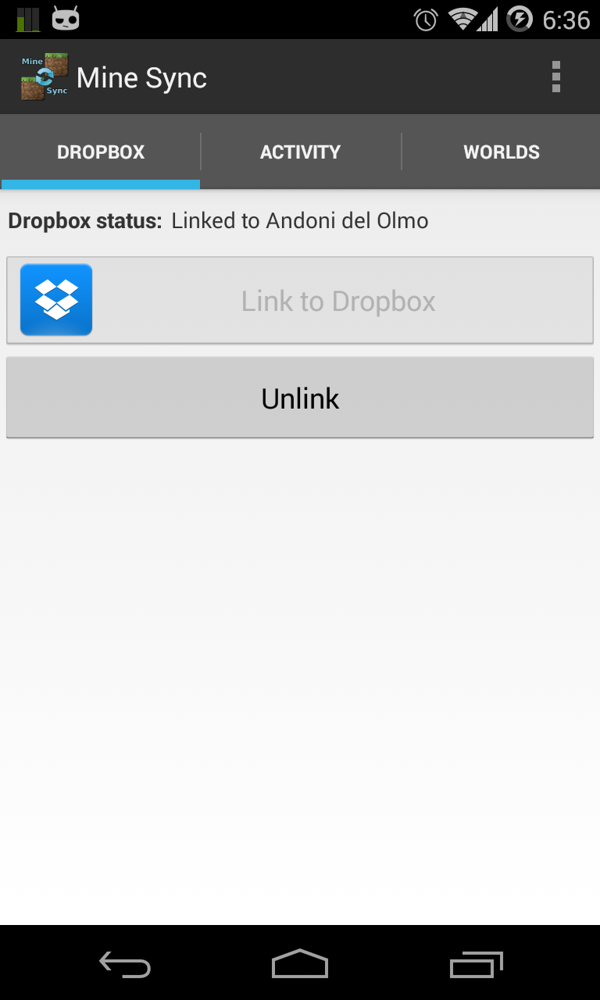
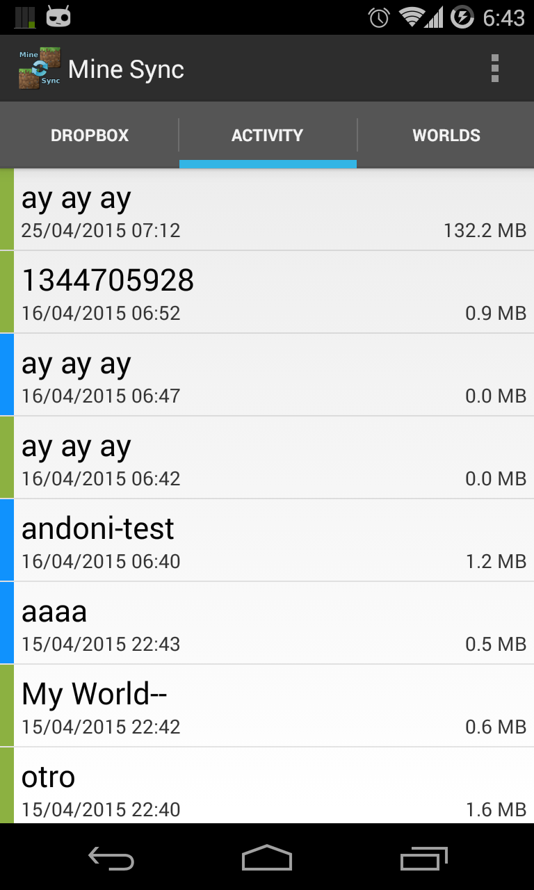
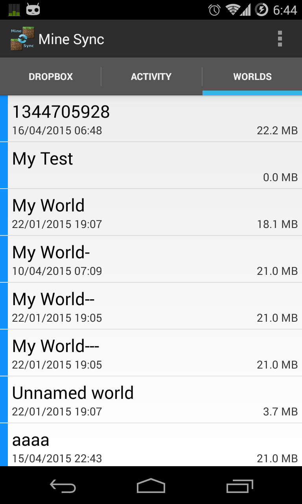
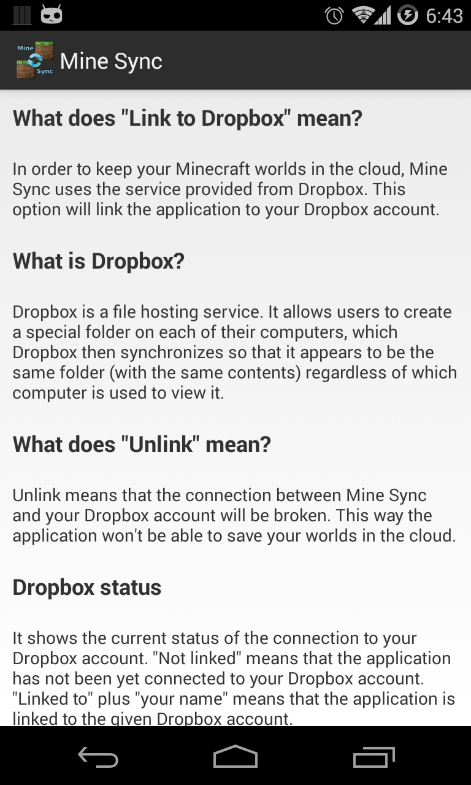

# Mine Sync
Sync your Minecraft PE worlds between all your Android devices. Your worlds always safe in the your Dropbox.

**Important: This project is not mantain anymore!**

If you are a Minecraft PE player, Mine Sync will allow you to keep your worlds sync over different Android devices (e.g. your phone and your tablet).

In case you only have one device where you play Minecraft PE, Mine Sync can help you out by keeping your worlds safe online so you can get them back in case you lose the worlds in your device (this could happen if you lose your phone!).

This can also be helpful when you get a new Android device. In this case, just by installing and launching Mine Sync you will get back all your saved worlds automatically.

You need a Dropbox account to get this application working.

## Build
### Requirements (tested):

* Java 7
* Maven 3.1.1
* Android emulator running

### Compile
	$ mvn clean install
